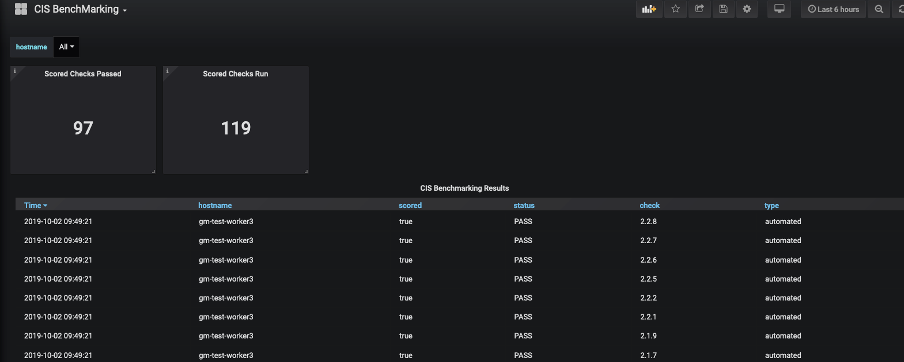
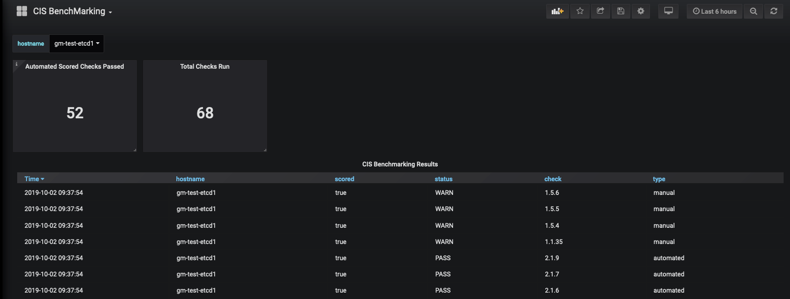

## kube-bench-metrics

kube-bench-metrics is a wrapper to execute aqusecurity/kube-bench.

It parses the results of the scan and exposes the results as prometheus metrics.

These can now be scraped by prometheus with subsequent alerting via Alertmanager.

The helm chart available in the **charts** directory can be used to quickly get started.

The `versionOverride` variable in values.yaml needs to be updated to specify the correct
version of checks to be run from **cfg** directory.

The pod by default re-runs the scan and publishes the metrics every hour.

However this can be configured using the ``--delay`` argument to the command in the containerSpec available in the packaged helm chart.

```
USAGE:
   kube-bench-metrics [global options] command [command options] [arguments...]

COMMANDS:
   help, h  Shows a list of commands or help for one command

GLOBAL OPTIONS:
   --check value, -c value     A comma delimited list of checks to run
   --versionOverride value     Version of checks to run
   --delay value, -d value     Delay in minutes between scheduled runs (default: 60)
   --nodeType value, -n value  Node classification: Possible values are node and master
   --help, -h                  show help
```

The current versions in **cfg** are a copy of ```github.com/rancher/security-scan``` and are customised for RKE environments.

These can be overriden. I will add support for all upstream kube-bench versions as well.

The inbuilt grafana dashboard can be deployed to quickly generate a simple view of the cluster compliance:

**Full Cluster View**


**Single Node View**


To Do:
* Build automation
* Test Cases
